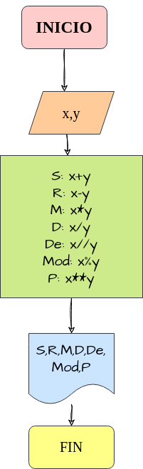

# Operaciones Aritmeticas
Programa para calcular la suma, resta, mutiplicacion, division, division entera, modulo, y potencia de dos numeros

## Calcuar mediante la suma, resta, mutiplicacion, divisiòn, division entera, modulo, y potencia de dos numeros

# ANALISIS

Variables de entrada (input)

x,y : numeros enteros ingresados

Variables de proceso y salida
(processing, storage, output)

S: x+y

R: x-y

M: x*y

D: x/y

De: x//y

Mod: x%y

P: x**y

# DISEÑO

# CONSTRUCCION
